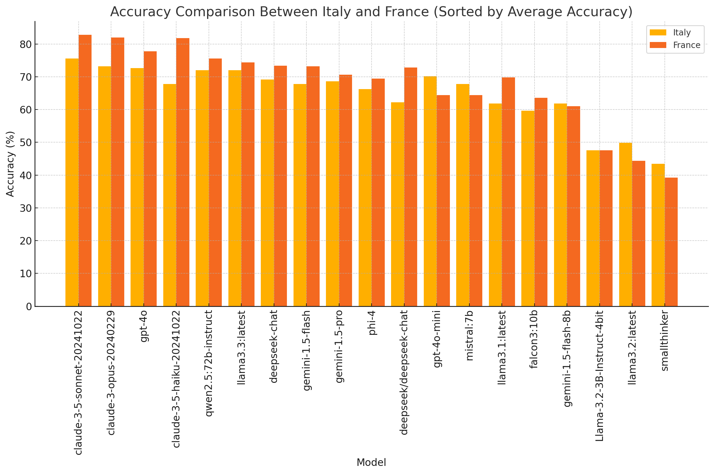
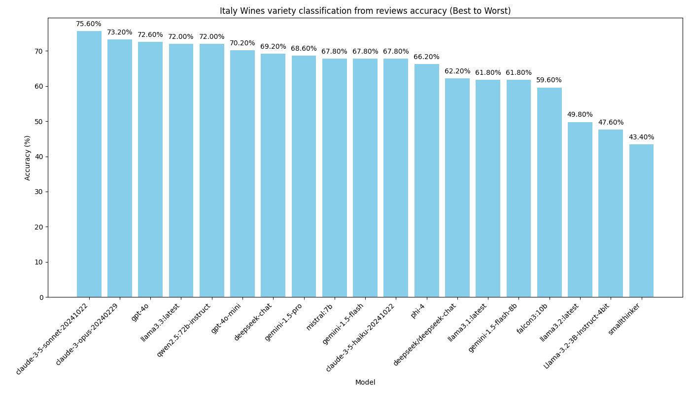
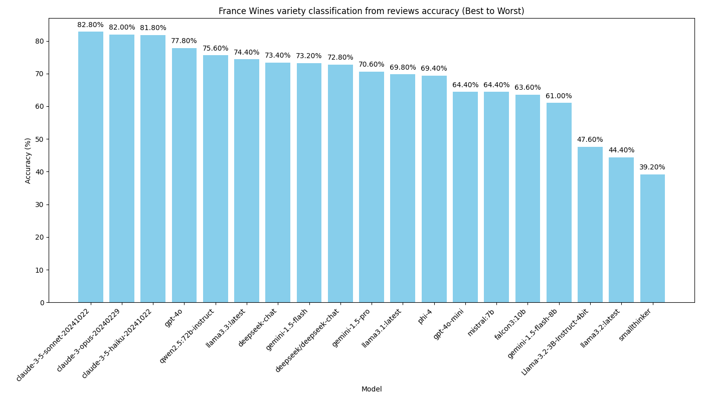

# Wine Variety Prediction with LLMs


This project demonstrates how to use various Large Language Models (LLMs) to predict wine varieties based on wine reviews and characteristics. It's inspired by [OpenAI's model distillation cookbook](https://cookbook.openai.com/examples/leveraging_model_distillation_to_fine-tune_a_model) but focuses on comparing different models' performance without distillation.

The goal is using native API for each provider where possible for this classification task.
Main focus is on local models through Ollama with llama.cpp and LM Studio with MLX.

## Results first
I ran the tests on Italian wines first and then French wines later to see if there was any difference in performance.
And...
- French wines are easier to predict than Italian wines!
- Anthropic models are the best performing classification models out there! Including Claude 3.5 Haiku.

Here is the chart that compares Italian and French results:


Here is the detailed chart for Italian wines:
 

Here is the detailed chart for French wines:


## Overview

The project uses a dataset of Italian wines to test different LLMs' ability to predict grape varieties based on wine descriptions, regions, and other characteristics. It showcases the use of Structured Outputs with various LLM providers and compares their performance.

## Features

- Wine variety prediction using multiple LLM providers:
  - [Ollama](https://ollama.ai)
  - [OpenAI](https://openai.com)
  - [Google Gemini](https://gemini.google.com)
  - [LM Studio](https://lmstudio.ai)
  - [OpenRouter](https://openrouter.ai)
  - [DeepSeek](https://deepseek.com)
  - [Anthropic](https://anthropic.com)
  - [MLX Omni Server](https://github.com/madroidmaq/mlx-omni-server)
- Structured Output implementation for consistent responses (where possible)
- Performance comparison between different models
- Support for parallel processing with some providers

## Prerequisites

- Python 3.12+
- Jupyter Notebook
- API keys for various providers (store in `.env` file):
  - OPENAI_API_KEY
  - GEMINI_API_KEY
  - OPENROUTER_API_KEY
  - DEEPSEEK_API_KEY
  - ANTHROPIC_API_KEY

## Recommendations

### Customizing Model Selection
The default configuration in `wine_all.py` includes some large models that may not run on all systems. To adapt for your hardware:

1. Edit `wine_all.py` to use models suitable for your system:
   - For Ollama: Use smaller models like "llama3.2"
   - For LM Studio: Stick to 3B-7B models with 4-bit quantization
   - Cloud models (OpenAI, Anthropic, etc.) don't have local hardware requirements

2. In individual provider files (e.g., `wine_ollama.py`), adjust model selections similarly

Example model substitutions for lower-end hardware:
- Replace "qwen2.5:72b-instruct" with "llama3.2"
- Remove "Llama3.3" 
In general feel free to add models available locally to Ollama or LM Studio.

### Performance vs Resource Trade-offs
- Smaller models (1B-3B) run faster but may have lower accuracy
- Mid-size models (7B-14B) offer good balance of performance and resource usage
- Largest models (>30B) provide best accuracy but require significant resources

## Dataset

The project uses the [Wine Reviews dataset](https://www.kaggle.com/datasets/zynicide/wine-reviews) from Kaggle. Download and place it in a `data` folder in your project directory.

## Project Structure

- `wine.ipynb` - Main Jupyter notebook with code and explanations
- `wine_all.py` - Implementation using all providers

In the providers folder you will find the individual implementations for each provider.
- `wine_openrouter.py` - Implementation using OpenRouter API
- `wine_ollama.py` - Implementation using Ollama
- `wine_gemini.py` - Implementation using Google Gemini
- `wine_lmstudio.py` - Implementation using LM Studio
- `wine_deepseek.py` - Implementation using DeepSeek
- `wine_anthropic.py` - Implementation using Anthropic
- `wine_openai.py` - Implementation using OpenAI (Structured)
- `wine_openai_unstructured.py` - Implementation using OpenAI with unstructured processing.

- `wine_mlx_omni_server.py` - Implementation using MLX Omni Server

## Usage

1. Clone the repository
2. Install dependencies:
   ```bash
   pip install ollama numpy pandas tqdm pydantic
   ```
3. Set up your environment variables in `.env` file
4. Download the dataset and place it in the `data` folder
5. Run the Jupyter notebook or individual Python scripts

### Running Individual Providers

You can run individual provider modules directly using Python's module syntax:

```bash
# Run MLX Omni Server provider
python -m providers.wine_mlx_omni_server

# Run Ollama provider
python -m providers.wine_ollama

# Run OpenAI provider (Structured)
python -m providers.wine_openai

# Run OpenAI Unstructured provider
python -m providers.wine_openai_unstructured


# Run Anthropic provider
python -m providers.wine_anthropic

# Run other providers similarly:
python -m providers.wine_gemini
python -m providers.wine_deepseek
python -m providers.wine_lmstudio
python -m providers.wine_openrouter

```

To run all providers at once:
```bash
python wine_all.py
```

Available command-line options:
```bash
python wine_all.py --generate-chart                           # Generate chart from most recent results without running new tests
python wine_all.py --generate-chart --summary SUMMARY_FILE    # Generate chart from specific summary file (e.g., summary_20250105_095642.csv)
python wine_all.py --no-provider-csv                         # Run tests but don't save individual provider results to CSV files
```

## Fine-tuning models with MLX
See [LORA.md](LORA.md) for instructions on how to fine-tune models using LoRA with MLX.

## TODO

- [ ] Test google-genai python package for Gemini

## DONE

- [x] Try [MLX Omni Server](https://github.com/madroidmaq/mlx-omni-server) for Apple MLX tests
- [x] Fine tune models with MLX with distillation (Phi-3.5-mini-instruct) 

## Contributing

Feel free to open issues or submit pull requests with improvements.

## License

[MIT License](LICENSE)

## Acknowledgments

- Inspired by [OpenAI's model distillation cookbook](https://cookbook.openai.com/examples/leveraging_model_distillation_to_fine-tune_a_model)
- Uses the Kaggle Wine Reviews dataset 